# Skill tree: everything, built from scratch

A dependency graph of what this repo builds from scratch — mathematics, low-level systems,
distributed systems, the cloud (AWS-shaped primitives), ML systems, agents and more. Each
node is one graded module in this repo's format (templates + `check.py` + `solutions/`, see
`.claude/skills/graded-module`), or an `exists` node pointing at material already built.

The tree's shape, acceptance criteria and procedure are fixed, so work proceeds node by
node, by a person or another model, without re-deciding the design each time. It is lightly
gamified (XP, levels, per-track and per-domain badges); the running count and current level
are in the generated section below, and [`tree.html`](tree.html) renders the whole tree as
an interactive map.

## Files

| File | What |
|---|---|
| `tree.toml` | the nodes: prerequisites, sources, what to build, acceptance criteria, limit cases, status, difficulty, kind |
| `books.toml` | the sources cited: `[book.*]` (cited by chapter) and `[doc.*]` (specs, RFCs, manuals); access notes marked "verify" were written from memory |
| `tracks.py` | the track registry (label, colour, root, domain) and the gamification rules (XP by difficulty, capstones, levels, badges) |
| `tree.py` | `check` validates; `next` lists ready nodes; `show <id>`; `order`; `status`; `xp`; `render` |
| `render_html.py` | renders `tree.html`: an interactive dependency map (tracks as columns, colour = track, shape = progress) |
| `tree.html` | the map, open it in a browser; regenerate with `render_html.py` after editing `tree.toml` |
| `test_tree.py` | breaks the tree in each way the validator must catch (cycle, unknown book, unknown difficulty, done without a checker...) |

```bash
python3 skill-tree/tree.py check      # must print OK before any commit that touches tree.toml
python3 skill-tree/tree.py next       # what can be worked on now
python3 skill-tree/tree.py xp         # XP, level, rank and badges per track
python3 skill-tree/tree.py show prml-09-mixtures-em
python3 skill-tree/render_html.py     # refresh tree.html after changing tree.toml
python3 -m unittest discover -s skill-tree -p 'test_*.py'
```

## How a node is worked on

The procedure is in [`.claude/skills/skill-tree-worker/SKILL.md`](../.claude/skills/skill-tree-worker/SKILL.md).
In short: take a node from `tree.py next`, build its module under its `deliverable` path
so that every `accept` and `limit_cases` item is a check in `check.py`, mutation-test the
checker, set the status to `done`, run `tree.py check` and `tree.py render`, commit.

## Rules that apply to every node

- **No copied text.** Book exercises are cited by number ("Bishop ex. 9.4") and restated
  in our own words; no prose, figures or solutions are copied from any book.
- **Derivations are verified numerically.** A gradient is checked by finite differences, an
  expectation by Monte Carlo with a stated tolerance, a closed form against simulation.
- **Limit cases are checks, not comments.** Each `limit_cases` item is a check that a naive
  implementation fails.
- **A node is `done` only when** its `check.py` exists, passes against `solutions/`,
  reports every step as TODO against the templates, and catches planted bugs.

## Tracks

Twenty tracks in five domains. A track is one column of the map and earns a badge when
every node in it is settled (graded or `exists`).

| Domain | Tracks |
|---|---|
| mathematics | foundations, linalg, probability, optimization, prml, lean |
| systems | lowlevel, distributed, databases, security, web, gpu, langs |
| cloud | cloud, deploy |
| ai | mlsys, llm, agents, quant |
| craft | algos |

The mathematics tracks cite their books in `books.toml`; the systems, cloud and ai tracks
cite books (CS:APP, OSTEP, DDIA, van Steen) and docs (AWS docs, the Raft paper, RFCs).
Adding a source means adding it to `books.toml` as either `[book.*]` or `[doc.*]`, then
nodes to `tree.toml`; `tree.py check` enforces the rest.

## Gamification

- **XP by difficulty.** A node is worth 10/25/60/120/250 XP for difficulty 1–5; a
  `kind = "capstone"` boss doubles it. `exists` material is worth nothing until it earns a
  graded `check.py`.
- **Levels.** Total XP crosses thresholds with rank names, Novice → Grandmaster.
- **Badges.** A track badge when every node in it is settled; a domain badge when all its
  tracks are. Shown in the map (a ★ on the column) and by `tree.py xp`.
- The point is honesty, not points: XP is a settled-aware progress signal, and the map still
  shows a dashed dot (and awards no XP) for material that lacks graded checks.

## The tree

Generated by `python3 tree.py render` from `tree.toml`; do not edit by hand.

<!-- BEGIN GENERATED: tree.py render -->
**54 of 113 nodes graded** — 105 settled (graded or already in the repo). Per track (graded/total): foundations 6/6, linalg 6/6, probability 7/7, optimization 4/4, prml 14/14, lean 0/1, lowlevel 5/8, distributed 5/7, databases 0/2, security 0/2, web 0/5, gpu 0/2, langs 0/3, cloud 5/5, deploy 0/1, mlsys 0/8, llm 0/10, agents 0/3, quant 0/1, algos 0/2, evals 2/16.

**Level 5 · Expert** — 2,590 / 2,590 XP, next at 3,500.
Badges: Foundations ✓ · Linear algebra ✓ · Probability ✓ · Optimisation ✓ · Pattern recognition ✓ · Lean ✓ · Low level ✓ · Distributed ✓ · Databases ✓ · Security ✓ · Web & protocols ✓ · GPU & performance ✓ · Languages ✓ · Cloud / AWS ✓ · Deploy & SRE ✓ · ML systems ✓ · LLMs ✓ · Agents ✓ · Quant ✓ · Algorithms & craft ✓ · domains: mathematics, systems, cloud, ai, craft

```mermaid
graph LR
  subgraph foundations
    foundations-01-linear-algebra["01 Vectors, matrices, linear systems"]:::done
    foundations-02-analytic-geometry["02 Norms, inner products, projections, rotations"]:::done
    foundations-03-matrix-decompositions["03 Eigendecomposition, Cholesky, SVD"]:::done
    foundations-04-vector-calculus["04 Gradients, Jacobians, chain rule, backpropagation"]:::done
    foundations-05-probability["05 Probability and distributions for ML"]:::done
    foundations-06-optimization["06 Continuous optimisation"]:::done
  end
  subgraph linalg
    linalg-01-vector-spaces["01 Vector spaces and linear maps"]:::done
    linalg-02-eigenvalues["02 Eigenvalues, invariant subspaces, diagonalisability"]:::done
    linalg-03-spectral-theorem["03 Inner product spaces and the spectral theorem"]:::done
    linalg-04-qr-least-squares["04 QR factorisation and least squares"]:::done
    linalg-05-conditioning-stability["05 Conditioning and numerical stability"]:::done
    linalg-06-eigenvalue-algorithms["06 Eigenvalue algorithms"]:::done
  end
  subgraph probability
    probability-01-counting-conditioning["01 Counting, conditional probability, Bayes"]:::done
    probability-02-random-variables["02 Discrete random variables and expectation"]:::done
    probability-03-continuous["03 Continuous random variables"]:::done
    probability-04-joint["04 Joint distributions and covariance"]:::done
    probability-05-limits-inequalities["05 Transformations, inequalities, limit theorems"]:::done
    probability-06-conditional-expectation["06 Conditional expectation"]:::done
    probability-07-markov-chains-mcmc["07 Markov chains and MCMC"]:::done
  end
  subgraph optimization
    optimization-01-convexity["01 Convex sets and convex functions"]:::done
    optimization-02-duality["02 Lagrangian duality and KKT"]:::done
    optimization-03-unconstrained["03 Unconstrained minimisation: gradient and Newton"]:::done
    optimization-04-interior-point["04 Equality constraints and interior-point methods"]:::done
  end
  subgraph prml
    prml-01-introduction["01 Curve fitting, bias-variance, decision and information theory"]:::done
    prml-02-distributions["02 Probability distributions and conjugacy"]:::done
    prml-03-linear-regression["03 Linear models for regression"]:::done
    prml-04-linear-classification["04 Linear models for classification"]:::done
    prml-05-neural-networks["05 Neural networks: backprop, Hessian, regularisation"]:::done
    prml-06-kernels-gps["06 Kernel methods and Gaussian processes"]:::done
    prml-07-svm["07 Sparse kernel machines: SVM"]:::done
    prml-08-graphical-models["08 Graphical models and message passing"]:::done
    prml-09-mixtures-em["09 Mixture models and EM"]:::done
    prml-10-variational-inference["10 Approximate inference: variational methods"]:::done
    prml-11-sampling["11 Sampling methods"]:::done
    prml-12-latent-continuous["12 Continuous latent variables: PCA, probabilistic PCA"]:::done
    prml-13-sequential["13 Sequential data: HMMs and linear dynamical systems"]:::done
    prml-14-combining-models["14 Combining models: trees, boosting, mixtures of experts"]:::done
  end
  subgraph lean
    lean-01-galois-path["01 Logic to the fundamental theorem of Galois theory (Lean 4)"]:::exists
  end
  subgraph lowlevel
    lowlevel-01-bit-representation["01 Bits: integers, floats, endianness"]:::done
    lowlevel-02-memory-layout["02 Struct layout, alignment, padding"]:::done
    lowlevel-03-allocator["03 A malloc: free list, split, coalesce"]:::done
    lowlevel-04-syscalls-io["04 File descriptors, read/write, buffering"]:::done
    lowlevel-05-concurrency["05 Locks, atomics, condition variables"]:::done
    lowlevel-06-bash-from-scratch["06 A shell from scratch"]:::exists
    lowlevel-07-c-compiler["07 A C compiler"]:::exists
    lowlevel-08-toralizer["08 Apt via LD_PRELOAD (toralizer)"]:::exists
  end
  subgraph distributed
    distributed-01-clocks["01 Time, Lamport and vector clocks"]:::done
    distributed-02-replication-quorums["02 Replication and quorums"]:::done
    distributed-03-consensus["03 Consensus (Raft): elect, replicate, commit"]:::done
    distributed-04-crdts["04 CRDTs: counters, registers, sets"]:::done
    distributed-05-partitioning["05 Partitioning and rebalancing"]:::done
    distributed-06-dynamo-paper["06 The Dynamo paper, implemented"]:::exists
    distributed-07-system-design["07 System design exercises"]:::exists
  end
  subgraph databases
    databases-01-relational-engine["01 A relational engine (B+tree, MVCC, WAL)"]:::exists
    databases-02-data-lineage["02 Data lineage tool"]:::exists
  end
  subgraph security
    security-01-cryptographic-library["01 A cryptographic library"]:::exists
    security-02-firewall["02 A firewall from scratch"]:::exists
  end
  subgraph web
    web-01-http-server["01 An HTTP server"]:::exists
    web-02-dns-server["02 A DNS server"]:::exists
    web-03-web-scraping["03 Web scraping"]:::exists
    web-04-launch-checklist["04 Launch checklist observers"]:::exists
    web-05-communication-protocols["05 Communication protocols"]:::exists
  end
  subgraph gpu
    gpu-01-cuda["01 CUDA from scratch"]:::exists
    gpu-02-compiler-and-vgpu["02 Compiler and virtual GPU"]:::exists
  end
  subgraph langs
    langs-01-haskell["01 Haskell projects"]:::exists
    langs-02-sgl["02 A small graph language"]:::exists
    langs-03-quantum["03 A quantum computing language"]:::exists
  end
  subgraph cloud
    cloud-01-object-store["01 An object store (S3-shaped)"]:::done
    cloud-02-iam-policy["02 An IAM policy evaluator"]:::done
    cloud-03-queue-fanout["03 A queue and pub/sub (SQS + SNS-shaped)"]:::done
    cloud-04-vpc-routing["04 A VPC: routes, security groups, NACLs"]:::done
    cloud-05-iac-drift["05 Infra as code and drift"]:::done
  end
  subgraph deploy
    deploy-01-deploy-and-debug["01 Deploy and debug"]:::exists
  end
  subgraph mlsys
    mlsys-01-ml-framework["01 An ML framework"]:::exists
    mlsys-02-model-serving["02 Model serving"]:::exists
    mlsys-03-inference-engine["03 An inference engine"]:::exists
    mlsys-04-tensorrt["04 TensorRT-style inference"]:::exists
    mlsys-05-inference-lab["05 Inference lab"]:::exists
    mlsys-06-distributed-training["06 Distributed training"]:::exists
    mlsys-07-mlops["07 MLOps"]:::exists
    mlsys-08-ml-in-production["08 ML in production"]:::exists
  end
  subgraph llm
    llm-01-llm-from-scratch["01 An LLM from scratch"]:::exists
    llm-02-rag["02 Retrieval-augmented generation"]:::exists
    llm-03-diffusion["03 Diffusion models"]:::exists
    llm-04-context-caching["04 Prompt caching and context"]:::exists
    llm-05-contextcite["05 Context attribution"]:::exists
    llm-06-world-models["06 World models"]:::exists
    llm-07-rl-posttraining["07 RL post-training of LLMs"]:::exists
    llm-08-spectral-graphs["08 Spectral graph methods"]:::exists
    llm-09-deepfake-creation["09 Deepfake creation"]:::exists
    llm-10-deepfake-detection["10 Deepfake detection"]:::exists
  end
  subgraph agents
    agents-01-agent-harness["01 An agent harness (Harness Lab)"]:::exists
    agents-02-mcp-server["02 An MCP server"]:::exists
    agents-03-agent-evals["03 Agent evaluation tooling"]:::exists
  end
  subgraph quant
    quant-01-quant-trading["01 Quantitative trading"]:::exists
  end
  subgraph algos
    algos-01-interview-prep["01 Interview preparation"]:::exists
    algos-02-codecraft["02 CodeCrafters-style course runner"]:::exists
  end
  subgraph evals
    evals-00-simulated-service["00 Simulated prod service (synthetic traffic + injected drift)"]:::done
    evals-01-trajectory-grading["01 Trajectory grading engine"]:::exists
    evals-02-shadow-routing["02 Shadow routing comparator"]:::done
    evals-03-judge-calibration["03 Calibrated LLM-as-a-judge"]:::blocked
    evals-04-ci-regression-gate["04 CI/CD regression gate"]
    evals-05-rag-adversarial["05 RAG adversarial harness"]:::exists
    evals-06-dpo-flywheel["06 Automated DPO flywheel"]:::blocked
    evals-07-statistical-significance["07 Statistical significance engine"]:::exists
    evals-08-redteam-fuzzer["08 Agent red-team fuzzer"]:::blocked
    evals-09-drift-monitor["09 Production drift monitor"]
    evals-10-cost-quality-pareto["10 Cost-quality Pareto dashboard"]
    evals-11-counterfactual-replay["11 Counterfactual replay debugger"]:::blocked
    evals-12-synthetic-edge-cases["12 Synthetic edge-case generator"]
    evals-13-context-eviction["13 Context-window eviction tester"]:::exists
    evals-14-dataset-contamination["14 Dataset contamination checker"]:::exists
    evals-15-methodology-teardown["15 Public eval methodology teardown"]:::blocked
  end
  foundations-01-linear-algebra --> foundations-02-analytic-geometry
  foundations-02-analytic-geometry --> foundations-03-matrix-decompositions
  foundations-01-linear-algebra --> foundations-04-vector-calculus
  foundations-04-vector-calculus --> foundations-05-probability
  foundations-04-vector-calculus --> foundations-06-optimization
  foundations-03-matrix-decompositions --> foundations-06-optimization
  foundations-01-linear-algebra --> linalg-01-vector-spaces
  linalg-01-vector-spaces --> linalg-02-eigenvalues
  linalg-02-eigenvalues --> linalg-03-spectral-theorem
  foundations-02-analytic-geometry --> linalg-03-spectral-theorem
  linalg-03-spectral-theorem --> linalg-04-qr-least-squares
  linalg-04-qr-least-squares --> linalg-05-conditioning-stability
  linalg-05-conditioning-stability --> linalg-06-eigenvalue-algorithms
  linalg-02-eigenvalues --> linalg-06-eigenvalue-algorithms
  probability-01-counting-conditioning --> probability-02-random-variables
  probability-02-random-variables --> probability-03-continuous
  foundations-04-vector-calculus --> probability-03-continuous
  probability-03-continuous --> probability-04-joint
  probability-04-joint --> probability-05-limits-inequalities
  probability-04-joint --> probability-06-conditional-expectation
  probability-06-conditional-expectation --> probability-07-markov-chains-mcmc
  foundations-06-optimization --> optimization-01-convexity
  optimization-01-convexity --> optimization-02-duality
  optimization-01-convexity --> optimization-03-unconstrained
  linalg-05-conditioning-stability --> optimization-03-unconstrained
  optimization-02-duality --> optimization-04-interior-point
  optimization-03-unconstrained --> optimization-04-interior-point
  foundations-05-probability --> prml-01-introduction
  probability-03-continuous --> prml-01-introduction
  prml-01-introduction --> prml-02-distributions
  probability-04-joint --> prml-02-distributions
  prml-02-distributions --> prml-03-linear-regression
  foundations-03-matrix-decompositions --> prml-03-linear-regression
  prml-03-linear-regression --> prml-04-linear-classification
  foundations-06-optimization --> prml-04-linear-classification
  prml-04-linear-classification --> prml-05-neural-networks
  foundations-04-vector-calculus --> prml-05-neural-networks
  prml-03-linear-regression --> prml-06-kernels-gps
  prml-06-kernels-gps --> prml-07-svm
  optimization-02-duality --> prml-07-svm
  prml-02-distributions --> prml-08-graphical-models
  prml-02-distributions --> prml-09-mixtures-em
  prml-09-mixtures-em --> prml-10-variational-inference
  prml-08-graphical-models --> prml-10-variational-inference
  prml-02-distributions --> prml-11-sampling
  probability-07-markov-chains-mcmc --> prml-11-sampling
  prml-09-mixtures-em --> prml-12-latent-continuous
  foundations-03-matrix-decompositions --> prml-12-latent-continuous
  prml-08-graphical-models --> prml-13-sequential
  prml-09-mixtures-em --> prml-13-sequential
  prml-12-latent-continuous --> prml-13-sequential
  prml-04-linear-classification --> prml-14-combining-models
  lowlevel-01-bit-representation --> lowlevel-02-memory-layout
  lowlevel-02-memory-layout --> lowlevel-03-allocator
  lowlevel-02-memory-layout --> lowlevel-04-syscalls-io
  lowlevel-03-allocator --> lowlevel-05-concurrency
  distributed-01-clocks --> distributed-02-replication-quorums
  distributed-02-replication-quorums --> distributed-03-consensus
  distributed-01-clocks --> distributed-04-crdts
  distributed-02-replication-quorums --> distributed-05-partitioning
  cloud-01-object-store --> cloud-03-queue-fanout
  cloud-01-object-store --> cloud-04-vpc-routing
  cloud-02-iam-policy --> cloud-05-iac-drift
  cloud-04-vpc-routing --> cloud-05-iac-drift
  evals-00-simulated-service --> evals-02-shadow-routing
  evals-00-simulated-service --> evals-09-drift-monitor
  evals-00-simulated-service --> evals-10-cost-quality-pareto
  classDef done fill:#2e7d32,color:#fff
  classDef wip fill:#f9a825
  classDef exists fill:#90a4ae
  classDef blocked fill:#c62828,color:#fff
```



| Node | Track | Requires | Status | Blocked by |
|---|---|---|---|---|
| `agents-01-agent-harness` An agent harness (Harness Lab) | agents | — | exists | — |
| `agents-02-mcp-server` An MCP server | agents | — | exists | — |
| `agents-03-agent-evals` Agent evaluation tooling | agents | — | exists | — |
| `algos-01-interview-prep` Interview preparation | algos | — | exists | — |
| `algos-02-codecraft` CodeCrafters-style course runner | algos | — | exists | — |
| `cloud-01-object-store` An object store (S3-shaped) | cloud | — | done | — |
| `cloud-02-iam-policy` An IAM policy evaluator | cloud | — | done | — |
| `cloud-03-queue-fanout` A queue and pub/sub (SQS + SNS-shaped) | cloud | cloud-01-object-store | done | — |
| `cloud-04-vpc-routing` A VPC: routes, security groups, NACLs | cloud | cloud-01-object-store | done | — |
| `cloud-05-iac-drift` Infra as code and drift | cloud | cloud-02-iam-policy, cloud-04-vpc-routing | done | — |
| `databases-01-relational-engine` A relational engine (B+tree, MVCC, WAL) | databases | — | exists | — |
| `databases-02-data-lineage` Data lineage tool | databases | — | exists | — |
| `deploy-01-deploy-and-debug` Deploy and debug | deploy | — | exists | — |
| `distributed-01-clocks` Time, Lamport and vector clocks | distributed | — | done | — |
| `distributed-02-replication-quorums` Replication and quorums | distributed | distributed-01-clocks | done | — |
| `distributed-03-consensus` Consensus (Raft): elect, replicate, commit | distributed | distributed-02-replication-quorums | done | — |
| `distributed-04-crdts` CRDTs: counters, registers, sets | distributed | distributed-01-clocks | done | — |
| `distributed-05-partitioning` Partitioning and rebalancing | distributed | distributed-02-replication-quorums | done | — |
| `distributed-06-dynamo-paper` The Dynamo paper, implemented | distributed | — | exists | — |
| `distributed-07-system-design` System design exercises | distributed | — | exists | — |
| `evals-00-simulated-service` Simulated prod service (synthetic traffic + injected drift) | evals | — | done | — |
| `evals-01-trajectory-grading` Trajectory grading engine | evals | — | exists | — |
| `evals-02-shadow-routing` Shadow routing comparator | evals | evals-00-simulated-service | done | — |
| `evals-03-judge-calibration` Calibrated LLM-as-a-judge | evals | — | todo | human-labels |
| `evals-04-ci-regression-gate` CI/CD regression gate | evals | — | todo | — |
| `evals-05-rag-adversarial` RAG adversarial harness | evals | — | exists | — |
| `evals-06-dpo-flywheel` Automated DPO flywheel | evals | — | todo | gpu |
| `evals-07-statistical-significance` Statistical significance engine | evals | — | exists | — |
| `evals-08-redteam-fuzzer` Agent red-team fuzzer | evals | — | exists | phase-2 |
| `evals-09-drift-monitor` Production drift monitor | evals | evals-00-simulated-service | todo | — |
| `evals-10-cost-quality-pareto` Cost-quality Pareto dashboard | evals | evals-00-simulated-service | todo | — |
| `evals-11-counterfactual-replay` Counterfactual replay debugger | evals | — | todo | phase-3 |
| `evals-12-synthetic-edge-cases` Synthetic edge-case generator | evals | — | todo | — |
| `evals-13-context-eviction` Context-window eviction tester | evals | — | exists | — |
| `evals-14-dataset-contamination` Dataset contamination checker | evals | — | exists | — |
| `evals-15-methodology-teardown` Public eval methodology teardown | evals | — | todo | owner-input |
| `foundations-01-linear-algebra` Vectors, matrices, linear systems | foundations | — | done | — |
| `foundations-02-analytic-geometry` Norms, inner products, projections, rotations | foundations | foundations-01-linear-algebra | done | — |
| `foundations-03-matrix-decompositions` Eigendecomposition, Cholesky, SVD | foundations | foundations-02-analytic-geometry | done | — |
| `foundations-04-vector-calculus` Gradients, Jacobians, chain rule, backpropagation | foundations | foundations-01-linear-algebra | done | — |
| `foundations-05-probability` Probability and distributions for ML | foundations | foundations-04-vector-calculus | done | — |
| `foundations-06-optimization` Continuous optimisation | foundations | foundations-04-vector-calculus, foundations-03-matrix-decompositions | done | — |
| `gpu-01-cuda` CUDA from scratch | gpu | — | exists | — |
| `gpu-02-compiler-and-vgpu` Compiler and virtual GPU | gpu | — | exists | — |
| `langs-01-haskell` Haskell projects | langs | — | exists | — |
| `langs-02-sgl` A small graph language | langs | — | exists | — |
| `langs-03-quantum` A quantum computing language | langs | — | exists | — |
| `lean-01-galois-path` Logic to the fundamental theorem of Galois theory (Lean 4) | lean | — | exists | — |
| `linalg-01-vector-spaces` Vector spaces and linear maps | linalg | foundations-01-linear-algebra | done | — |
| `linalg-02-eigenvalues` Eigenvalues, invariant subspaces, diagonalisability | linalg | linalg-01-vector-spaces | done | — |
| `linalg-03-spectral-theorem` Inner product spaces and the spectral theorem | linalg | linalg-02-eigenvalues, foundations-02-analytic-geometry | done | — |
| `linalg-04-qr-least-squares` QR factorisation and least squares | linalg | linalg-03-spectral-theorem | done | — |
| `linalg-05-conditioning-stability` Conditioning and numerical stability | linalg | linalg-04-qr-least-squares | done | — |
| `linalg-06-eigenvalue-algorithms` Eigenvalue algorithms | linalg | linalg-05-conditioning-stability, linalg-02-eigenvalues | done | — |
| `llm-01-llm-from-scratch` An LLM from scratch | llm | — | exists | — |
| `llm-02-rag` Retrieval-augmented generation | llm | — | exists | — |
| `llm-03-diffusion` Diffusion models | llm | — | exists | — |
| `llm-04-context-caching` Prompt caching and context | llm | — | exists | — |
| `llm-05-contextcite` Context attribution | llm | — | exists | — |
| `llm-06-world-models` World models | llm | — | exists | — |
| `llm-07-rl-posttraining` RL post-training of LLMs | llm | — | exists | — |
| `llm-08-spectral-graphs` Spectral graph methods | llm | — | exists | — |
| `llm-09-deepfake-creation` Deepfake creation | llm | — | exists | — |
| `llm-10-deepfake-detection` Deepfake detection | llm | — | exists | — |
| `lowlevel-01-bit-representation` Bits: integers, floats, endianness | lowlevel | — | done | — |
| `lowlevel-02-memory-layout` Struct layout, alignment, padding | lowlevel | lowlevel-01-bit-representation | done | — |
| `lowlevel-03-allocator` A malloc: free list, split, coalesce | lowlevel | lowlevel-02-memory-layout | done | — |
| `lowlevel-04-syscalls-io` File descriptors, read/write, buffering | lowlevel | lowlevel-02-memory-layout | done | — |
| `lowlevel-05-concurrency` Locks, atomics, condition variables | lowlevel | lowlevel-03-allocator | done | — |
| `lowlevel-06-bash-from-scratch` A shell from scratch | lowlevel | — | exists | — |
| `lowlevel-07-c-compiler` A C compiler | lowlevel | — | exists | — |
| `lowlevel-08-toralizer` Apt via LD_PRELOAD (toralizer) | lowlevel | — | exists | — |
| `mlsys-01-ml-framework` An ML framework | mlsys | — | exists | — |
| `mlsys-02-model-serving` Model serving | mlsys | — | exists | — |
| `mlsys-03-inference-engine` An inference engine | mlsys | — | exists | — |
| `mlsys-04-tensorrt` TensorRT-style inference | mlsys | — | exists | — |
| `mlsys-05-inference-lab` Inference lab | mlsys | — | exists | — |
| `mlsys-06-distributed-training` Distributed training | mlsys | — | exists | — |
| `mlsys-07-mlops` MLOps | mlsys | — | exists | — |
| `mlsys-08-ml-in-production` ML in production | mlsys | — | exists | — |
| `optimization-01-convexity` Convex sets and convex functions | optimization | foundations-06-optimization | done | — |
| `optimization-02-duality` Lagrangian duality and KKT | optimization | optimization-01-convexity | done | — |
| `optimization-03-unconstrained` Unconstrained minimisation: gradient and Newton | optimization | optimization-01-convexity, linalg-05-conditioning-stability | done | — |
| `optimization-04-interior-point` Equality constraints and interior-point methods | optimization | optimization-02-duality, optimization-03-unconstrained | done | — |
| `probability-01-counting-conditioning` Counting, conditional probability, Bayes | probability | — | done | — |
| `probability-02-random-variables` Discrete random variables and expectation | probability | probability-01-counting-conditioning | done | — |
| `probability-03-continuous` Continuous random variables | probability | probability-02-random-variables, foundations-04-vector-calculus | done | — |
| `prml-01-introduction` Curve fitting, bias-variance, decision and information theory | prml | foundations-05-probability, probability-03-continuous | done | — |
| `probability-04-joint` Joint distributions and covariance | probability | probability-03-continuous | done | — |
| `prml-02-distributions` Probability distributions and conjugacy | prml | prml-01-introduction, probability-04-joint | done | — |
| `prml-03-linear-regression` Linear models for regression | prml | prml-02-distributions, foundations-03-matrix-decompositions | done | — |
| `prml-04-linear-classification` Linear models for classification | prml | prml-03-linear-regression, foundations-06-optimization | done | — |
| `prml-05-neural-networks` Neural networks: backprop, Hessian, regularisation | prml | prml-04-linear-classification, foundations-04-vector-calculus | done | — |
| `prml-06-kernels-gps` Kernel methods and Gaussian processes | prml | prml-03-linear-regression | done | — |
| `prml-07-svm` Sparse kernel machines: SVM | prml | prml-06-kernels-gps, optimization-02-duality | done | — |
| `prml-08-graphical-models` Graphical models and message passing | prml | prml-02-distributions | done | — |
| `prml-09-mixtures-em` Mixture models and EM | prml | prml-02-distributions | done | — |
| `prml-10-variational-inference` Approximate inference: variational methods | prml | prml-09-mixtures-em, prml-08-graphical-models | done | — |
| `prml-12-latent-continuous` Continuous latent variables: PCA, probabilistic PCA | prml | prml-09-mixtures-em, foundations-03-matrix-decompositions | done | — |
| `prml-13-sequential` Sequential data: HMMs and linear dynamical systems | prml | prml-08-graphical-models, prml-09-mixtures-em, prml-12-latent-continuous | done | — |
| `prml-14-combining-models` Combining models: trees, boosting, mixtures of experts | prml | prml-04-linear-classification | done | — |
| `probability-05-limits-inequalities` Transformations, inequalities, limit theorems | probability | probability-04-joint | done | — |
| `probability-06-conditional-expectation` Conditional expectation | probability | probability-04-joint | done | — |
| `probability-07-markov-chains-mcmc` Markov chains and MCMC | probability | probability-06-conditional-expectation | done | — |
| `prml-11-sampling` Sampling methods | prml | prml-02-distributions, probability-07-markov-chains-mcmc | done | — |
| `quant-01-quant-trading` Quantitative trading | quant | — | exists | — |
| `security-01-cryptographic-library` A cryptographic library | security | — | exists | — |
| `security-02-firewall` A firewall from scratch | security | — | exists | — |
| `web-01-http-server` An HTTP server | web | — | exists | — |
| `web-02-dns-server` A DNS server | web | — | exists | — |
| `web-03-web-scraping` Web scraping | web | — | exists | — |
| `web-04-launch-checklist` Launch checklist observers | web | — | exists | — |
| `web-05-communication-protocols` Communication protocols | web | — | exists | — |
<!-- END GENERATED -->
