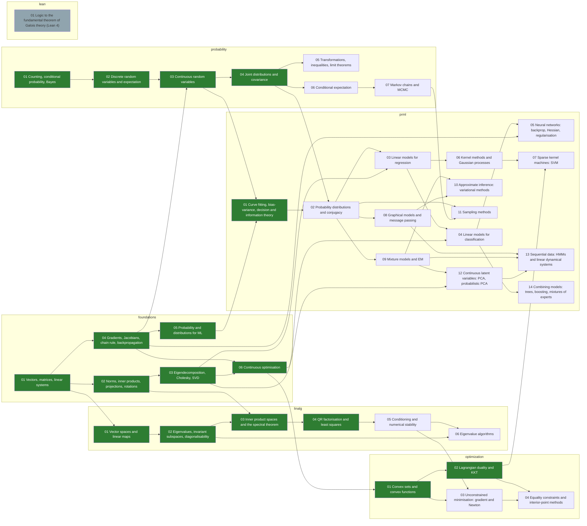

# Skill tree: mathematics and pattern recognition

A dependency graph of mathematical skills, from linear systems to variational inference.
Each node is one graded module in [`math/`](../math/), built in this repo's format
(templates + `check.py` + `solutions/`, see `.claude/skills/graded-module`).

The tree's shape, acceptance criteria and procedure are fixed, so work proceeds node by
node, by a person or another model, without re-deciding the design each time. The running
count of built nodes is in the generated section below, and
[`tree.html`](tree.html) renders the whole tree as an interactive map.

## Files

| File | What |
|---|---|
| `tree.toml` | the nodes: prerequisites, sources, what to build, acceptance criteria, limit cases, status |
| `books.toml` | the books cited; access notes marked "verify" were written from memory |
| `tree.py` | `check` validates; `next` lists ready nodes; `show <id>`; `order`; `status`; `render` |
| `render_html.py` | renders `tree.html`: an interactive dependency map (tracks as columns, colour = track, shape = progress) |
| `tree.html` | the map, open it in a browser; regenerate with `render_html.py` after editing `tree.toml` |
| `test_tree.py` | breaks the tree in each way the validator must catch (cycle, unknown book, done without a checker...) |

```bash
python3 skill-tree/tree.py check      # must print OK before any commit that touches tree.toml
python3 skill-tree/tree.py next       # what can be worked on now
python3 skill-tree/tree.py show prml-09-mixtures-em
python3 skill-tree/render_html.py     # refresh tree.html after changing tree.toml
python3 -m unittest discover -s skill-tree -p 'test_*.py'
```

## How a node is worked on

The procedure is in [`.claude/skills/skill-tree-worker/SKILL.md`](../.claude/skills/skill-tree-worker/SKILL.md).
In short: take a node from `tree.py next`, build its module under its `deliverable` path
so that every `accept` and `limit_cases` item is a check in `check.py`, mutation-test the
checker, set the status to `done`, run `tree.py check` and `tree.py render`, commit.

## Rules that apply to every node

- **No copied text.** Book exercises are cited by number ("Bishop ex. 9.4") and restated
  in our own words; no prose, figures or solutions are copied from any book.
- **Derivations are verified numerically.** A gradient is checked by finite differences, an
  expectation by Monte Carlo with a stated tolerance, a closed form against simulation.
- **Limit cases are checks, not comments.** Each `limit_cases` item is a check that a naive
  implementation fails.
- **A node is `done` only when** its `check.py` exists, passes against `solutions/`,
  reports every step as TODO against the templates, and catches planted bugs.

## Tracks

| Track | Books | Nodes |
|---|---|---|
| foundations | Deisenroth, Faisal & Ong, *Mathematics for Machine Learning* | 6 |
| linalg | Axler, *Linear Algebra Done Right*; Trefethen & Bau, *Numerical Linear Algebra* | 6 |
| probability | Blitzstein & Hwang, *Introduction to Probability* | 7 |
| optimization | Boyd & Vandenberghe, *Convex Optimization* | 4 |
| prml | Bishop, *Pattern Recognition and Machine Learning* (+ Murphy, MML as alternates) | 14 |
| lean | existing [`lean-proofs/`](../lean-proofs/) (no checker yet) | 1 |

The book list is a starting choice, not a fixed one. Adding a book means adding it to
`books.toml` and nodes to `tree.toml`; `tree.py check` enforces the rest.

## The tree

Generated by `python3 tree.py render` from `tree.toml`; do not edit by hand.

<!-- BEGIN GENERATED: tree.py render -->
**17 of 38 nodes built** (foundations 6/6, linalg 4/6, probability 4/7, optimization 2/4, prml 1/14, lean 0/1).



| Node | Track | Requires | Status |
|---|---|---|---|
| `foundations-01-linear-algebra` Vectors, matrices, linear systems | foundations | — | done |
| `foundations-02-analytic-geometry` Norms, inner products, projections, rotations | foundations | foundations-01-linear-algebra | done |
| `foundations-03-matrix-decompositions` Eigendecomposition, Cholesky, SVD | foundations | foundations-02-analytic-geometry | done |
| `foundations-04-vector-calculus` Gradients, Jacobians, chain rule, backpropagation | foundations | foundations-01-linear-algebra | done |
| `foundations-05-probability` Probability and distributions for ML | foundations | foundations-04-vector-calculus | done |
| `foundations-06-optimization` Continuous optimisation | foundations | foundations-04-vector-calculus, foundations-03-matrix-decompositions | done |
| `lean-01-galois-path` Logic to the fundamental theorem of Galois theory (Lean 4) | lean | — | exists |
| `linalg-01-vector-spaces` Vector spaces and linear maps | linalg | foundations-01-linear-algebra | done |
| `linalg-02-eigenvalues` Eigenvalues, invariant subspaces, diagonalisability | linalg | linalg-01-vector-spaces | done |
| `linalg-03-spectral-theorem` Inner product spaces and the spectral theorem | linalg | linalg-02-eigenvalues, foundations-02-analytic-geometry | done |
| `linalg-04-qr-least-squares` QR factorisation and least squares | linalg | linalg-03-spectral-theorem | done |
| `linalg-05-conditioning-stability` Conditioning and numerical stability | linalg | linalg-04-qr-least-squares | todo |
| `linalg-06-eigenvalue-algorithms` Eigenvalue algorithms | linalg | linalg-05-conditioning-stability, linalg-02-eigenvalues | todo |
| `optimization-01-convexity` Convex sets and convex functions | optimization | foundations-06-optimization | done |
| `optimization-02-duality` Lagrangian duality and KKT | optimization | optimization-01-convexity | done |
| `optimization-03-unconstrained` Unconstrained minimisation: gradient and Newton | optimization | optimization-01-convexity, linalg-05-conditioning-stability | todo |
| `optimization-04-interior-point` Equality constraints and interior-point methods | optimization | optimization-02-duality, optimization-03-unconstrained | todo |
| `probability-01-counting-conditioning` Counting, conditional probability, Bayes | probability | — | done |
| `probability-02-random-variables` Discrete random variables and expectation | probability | probability-01-counting-conditioning | done |
| `probability-03-continuous` Continuous random variables | probability | probability-02-random-variables, foundations-04-vector-calculus | done |
| `prml-01-introduction` Curve fitting, bias-variance, decision and information theory | prml | foundations-05-probability, probability-03-continuous | done |
| `probability-04-joint` Joint distributions and covariance | probability | probability-03-continuous | done |
| `prml-02-distributions` Probability distributions and conjugacy | prml | prml-01-introduction, probability-04-joint | todo |
| `prml-03-linear-regression` Linear models for regression | prml | prml-02-distributions, foundations-03-matrix-decompositions | todo |
| `prml-04-linear-classification` Linear models for classification | prml | prml-03-linear-regression, foundations-06-optimization | todo |
| `prml-05-neural-networks` Neural networks: backprop, Hessian, regularisation | prml | prml-04-linear-classification, foundations-04-vector-calculus | todo |
| `prml-06-kernels-gps` Kernel methods and Gaussian processes | prml | prml-03-linear-regression | todo |
| `prml-07-svm` Sparse kernel machines: SVM | prml | prml-06-kernels-gps, optimization-02-duality | todo |
| `prml-08-graphical-models` Graphical models and message passing | prml | prml-02-distributions | todo |
| `prml-09-mixtures-em` Mixture models and EM | prml | prml-02-distributions | todo |
| `prml-10-variational-inference` Approximate inference: variational methods | prml | prml-09-mixtures-em, prml-08-graphical-models | todo |
| `prml-12-latent-continuous` Continuous latent variables: PCA, probabilistic PCA | prml | prml-09-mixtures-em, foundations-03-matrix-decompositions | todo |
| `prml-13-sequential` Sequential data: HMMs and linear dynamical systems | prml | prml-08-graphical-models, prml-09-mixtures-em, prml-12-latent-continuous | todo |
| `prml-14-combining-models` Combining models: trees, boosting, mixtures of experts | prml | prml-04-linear-classification | todo |
| `probability-05-limits-inequalities` Transformations, inequalities, limit theorems | probability | probability-04-joint | todo |
| `probability-06-conditional-expectation` Conditional expectation | probability | probability-04-joint | todo |
| `probability-07-markov-chains-mcmc` Markov chains and MCMC | probability | probability-06-conditional-expectation | todo |
| `prml-11-sampling` Sampling methods | prml | prml-02-distributions, probability-07-markov-chains-mcmc | todo |
<!-- END GENERATED -->
